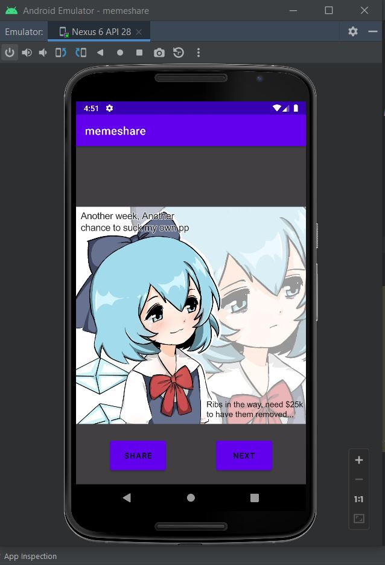

# MemeShare-App-in-KOTLIN + API
<h1 align="center">Meme - Share - App</h1>
 
 
<h3 align="center">This app using a Reddit thread API [url =" https://meme-api.herokuapp.com/gimme "] made in kotlin , this project is also using Volley library to maintain and sync execution of request queue of API. This also comes with sharing capability.
</h3>
 
 
<h3 align="center">To view this project download "MEME_SHARE_PROJECT_FILE.zip" and open it in ANDROID STUDIO.in case you want only Activity file or main kotlin file you can find in this repo's file section.</h3>
<h1 align="center">OUTPUT</h1>
 
 

